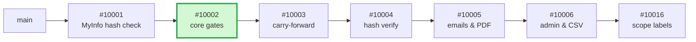
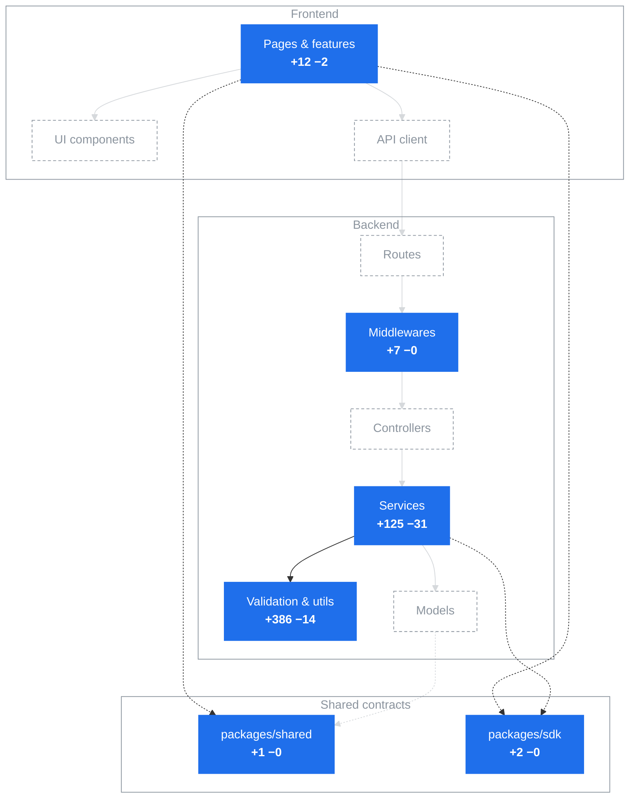

## Context

MyInfo-authed multirespondent forms (MRF) can't collect child data: Children fields are hard-rejected on submission and hidden from the MRF builder. This PR enables them end-to-end behind flags, so MRF forms can start collecting child records once we're ready to turn them on.

**Stack** — 2/7

#10001 fixed MyInfo hash verification on step-1 MRF submissions; this PR opens up the Children field itself, and #10003 adds read-only carry-forward of the answers to steps 2+.

## Implementation

Allow Children fields on MRF, gated behind the existing per-admin `betaFlags.children` **and** a new default-off `mrf-children` feature flag.

- **Submission gate (middleware + utils)** — `validateMrfFieldResponses` accepts a Children response only when the flag is on, it's the first workflow step (MyInfo sessions are step-1-only), and the form's auth is MyInfo. The flag check fails closed, mirroring the `mrf-payments` kill switch.
- **Validation** — `constructChildrenValidatorV4` was a no-op; it now enforces the V3 rules on the V4 answer shape: well-formed answer, max-children cap, answered attributes must exactly match the field's subfields, no empty values.
- **Shared contracts** — the `mrf-children` flag constant lands in `packages/shared`, with the V4 children answer types re-exported from the published SDK.
- **Builder (frontend)** — the MyInfo panel offers the Children section on MRF forms when both flags are on.

**Breaking Changes**

No — Children on MRF stays rejected until the default-off `mrf-children` flag is enabled; encrypt-mode behaviour is untouched.

## Tests

**TC1: flag off (default)**

- [ ] MRF + MyInfo form: step-1 Children submission is rejected (422)

**TC2: flag on, happy path**

- [ ] Step-1 Children submission with one complete child is accepted

**TC3: flag on, still rejected**

- [ ] Step-2 respondent posts a *changed* Children response → rejected
- [ ] Non-MyInfo MRF form with a Children response → rejected
- [ ] Tampered payload (extra attribute / empty value / over the max-children cap) → rejected

**TC4: builder**

- [ ] Children section appears for a beta-flagged admin on an MRF form only when the flag is on; encrypt forms unchanged

## Deploy Notes

**New feature flags**:

- `mrf-children` (GrowthBook) — default off; gates Children on MRF end-to-end

🤖 Generated with [Claude Code](https://claude.com/claude-code)
