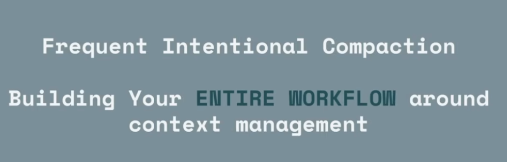

# formsg-ai

AI productivity tools for FormSG — shared Claude Code skills and autonomous agent projects.

## Primer: Effective AI Usage

To make AI agents work well, there are 2 fundamental ideas: 
1. context management = keep your agent context minimal and focused 
2. grounding = provide ground truths (eg, prompt, grill-me, docs) your agent can adhere itself to




This repository is an implementation of the above 2 key ideas. 

## Contents

| Folder | Purpose |
|--------|---------|
| `skills/` | Claude Code slash-command skills, organized into `engineering/` and `general/` buckets |

## Installing the skills (for Claude Code)

```bash
npx skills@1.5.10 add opengovsg/formsg-ai -g -a claude-code -y
```

Then restart Claude Code.

### Per-repo setup

After installing, run this once in each repo where you want the engineering skills:

```
/setup-formsg-ai-skills
```

This scaffolds the per-repo config (`docs/agents/`) that skills like `tdd`, `to-issues`, and `prepare-for-review` depend on.

## Recommended coding workflow

See [skills/engineering/README.md](skills/engineering/README.md) for the full step-by-step workflow.

## Skills reference

See [skills/README.md](skills/README.md) for the full skill list.
