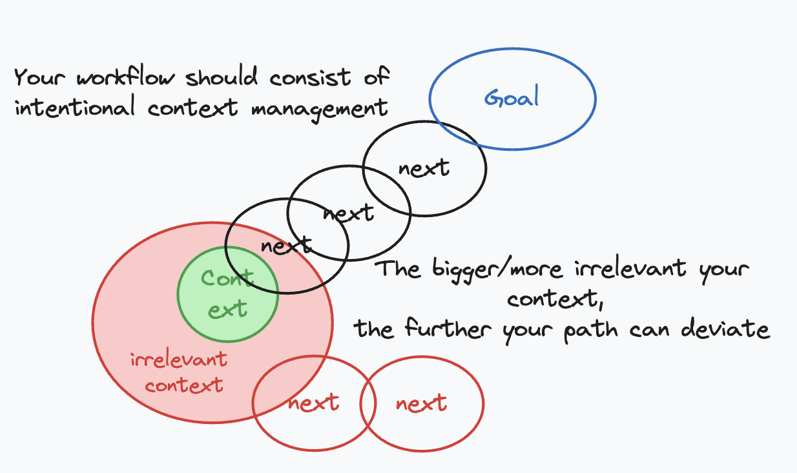

# formsg-ai

AI productivity tools for FormSG — shared Claude Code skills and autonomous agent projects.

## Primer: Effective AI Usage

To make AI agents work well, there are 2 fundamental ideas:

| **1. Context management** | **2. Grounding** |
|---|---|
| Keep your agent context minimal and focused | Provide strong ground truths (bonsai wire eg, prompt, grill-me, docs, tests) your agent can adhere itself to |
| <p align="center"></p> | <p align="center"></p> |

This repository is an implementation of the above 2 key ideas. 

## Contents

| Folder | Purpose |
|--------|---------|
| `skills/` | Claude Code slash-command skills, organized into `engineering/` and `general/` buckets |

## Installing the skills (for Claude Code)

```bash
npx skills@1.5.10 add opengovsg/formsg-ai -g -a claude-code -y
```

Then restart Claude Code.

### Per-repo setup

After installing, run this once in each repo where you want the engineering skills:

```
/setup-formsg-ai-skills
```

This scaffolds the per-repo config (`docs/agents/`) that skills like `tdd`, `to-issues`, and `prepare-for-review` depend on.

## Recommended coding workflow

See [skills/engineering/README.md](skills/engineering/README.md) for the full step-by-step workflow.

## Skills reference

See [skills/README.md](skills/README.md) for the full skill list.

## Acknowledgements 
This repository acknowledges the work from Matt Pocock's [skills](https://github.com/mattpocock/skills), which some of these skills and ideas are based and adapted off.  