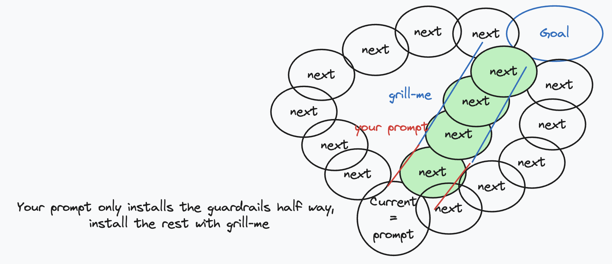
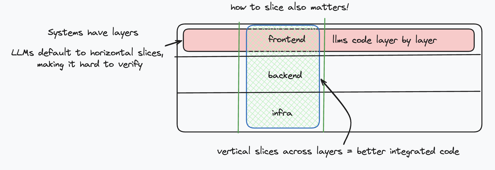
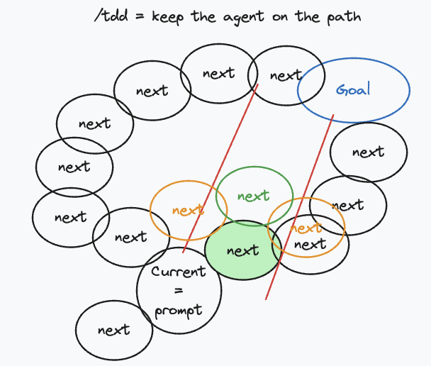
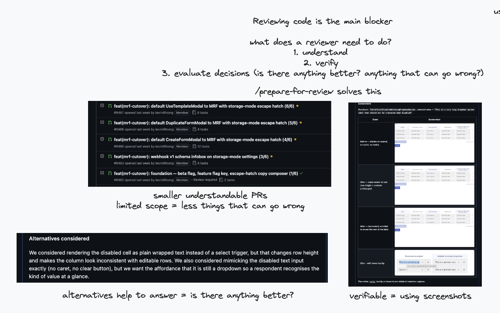

# Engineering skills

Skills for day-to-day code work. All of these depend on per-repo configuration — run `/setup-formsg-ai-skills` once in a repo before using any other skill here.

## Setup

```
/setup-formsg-ai-skills
```

Writes `docs/agents/` files that tell the other skills:
- **Where issues live** — GitHub Issues or local `.scratch/` markdown
- **Triage label strings** — the five canonical triage roles (`needs-triage`, `needs-info`, `ready-for-agent`, `ready-for-human`, `wontfix`)
- **Domain doc layout** — where `CONTEXT.md` and `docs/adr/` live
- **Review-prep conventions** — commit style and breadcrumb schema consumed by `tdd` and `prepare-for-review`

## Skills

| Skill | Description |
|-------|-------------|
| [`/setup-formsg-ai-skills`](setup-formsg-ai-skills/SKILL.md) | Scaffold per-repo agent config — run this first |
| [`/tdd`](tdd/SKILL.md) | Red-green-refactor loop; frontend slices get a visual gate against a Figma design source via Storybook |
| [`/review`](review/SKILL.md) | Multi-axis PR review across Standards, Spec, Architecture, and Divergent — each axis runs as a parallel sub-agent |
| [`/prepare-for-review`](prepare-for-review/SKILL.md) | Assemble a PR body and inline comments from breadcrumbs, ADRs, and the originating PRD — run when implementation is done |
| [`/to-issues`](to-issues/SKILL.md) | Break a plan or PRD into independently-grabbable vertical-slice issues on the project issue tracker |
| [`/to-prd`](to-prd/SKILL.md) | Turn conversation context into a PRD and publish it to the issue tracker |
| [`/grill-with-docs`](grill-with-docs/SKILL.md) | Stress-test a plan against the repo's CONTEXT.md and ADRs; updates documentation inline as decisions crystallise |
| [`/improve-codebase-architecture`](improve-codebase-architecture/SKILL.md) | Surface deepening opportunities — shallow-to-deep refactors that improve testability and AI-navigability |
| [`/zoom-out`](zoom-out/SKILL.md) | Get a module map of a code area you're unfamiliar with, using the project's domain glossary |

## Recommended workflow

The goal is to spend the bulk of your time thinking and setting guardrails — before a single line of code is written.

### 1. Plan (spend ~80% of your time here)

```
/grill-with-docs
```

| | |
|:---|:---:|
| Interview yourself relentlessly against the existing domain model. The skill asks one question at a time, explores the codebase rather than guessing, and updates `CONTEXT.md` and ADRs inline as decisions crystallise. Keep going until you've resolved every branch of the design tree and the guardrails are clear all the way to the end goal. |  |

### 2. Write the PRD

```
/to-prd
```

Synthesises everything from the grilling session into a PRD and publishes it to the issue tracker. No need to review the AI's summary — the grilling session already captured the decisions.

### 3. Split into issues

```
/to-issues
```

Breaks the PRD into independently-grabbable vertical-slice issues. Each issue goes to a **fresh agent** with undiluted context — do not carry the planning conversation into implementation.

| Vertical slicing — cut through every layer, not layer by layer |
|:---:|
|  |

### 4. Implement with TDD (one issue per agent)

```
/tdd
```

| | |
|:---|:---:|
| Red-green-refactor loop per issue. For frontend slices, the skill runs a visual gate against a Figma design source via an agent browser — make sure [`agent-browser`](https://github.com/browserbase/agent-browser) (or equivalent) is installed before starting.<br><br>The loop: write a failing test → make it pass → refactor → drop a breadcrumb for any non-obvious decision → repeat. |  |

### 5. Prepare for review

```
/prepare-for-review
```

Collects the breadcrumbs, relevant ADRs, and the originating PRD and assembles them into a PR body and inline comments. The goal is a PR that reviewers can understand, verify, and merge without needing to re-derive rationale from the diff.

| Prepare for review — help reviewers understand, verify, and evaluate decisions |
|:---:|
|  |

### 6. Review

```
/review
```

Runs four independent parallel sub-agents across the diff — Standards, Spec, Architecture, and Divergent design — then filters false positives and surfaces findings side-by-side. Use this before merging to catch issues across all four axes without one axis polluting another's context.

---

### At a glance

```
/setup-formsg-ai-skills          # once per repo

/grill-with-docs                 # 80% of effort: think, plan, set guardrails
/to-prd                          # publish PRD (no need to review AI summary)
/to-issues                       # split into issues → each gets a fresh agent

# per issue, in a new agent session:
/tdd                             # red-green-refactor (install agent-browser first)

# when implementation is done:
/prepare-for-review              # build PR from breadcrumbs + ADRs
/review                          # 4-axis review: Standards, Spec, Architecture, Divergent
```
