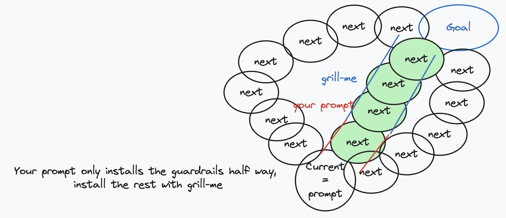
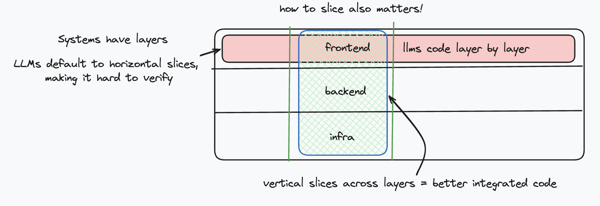
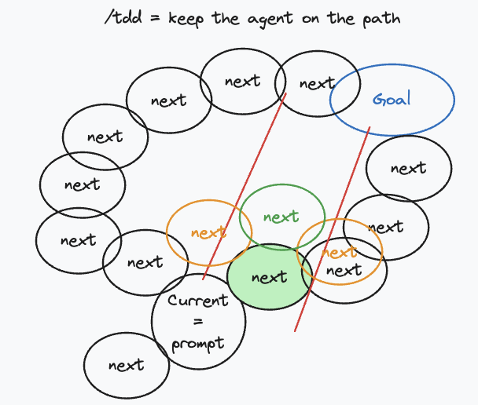
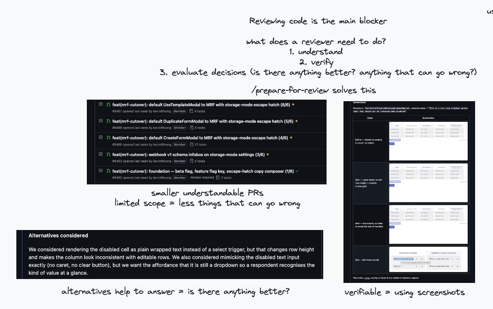
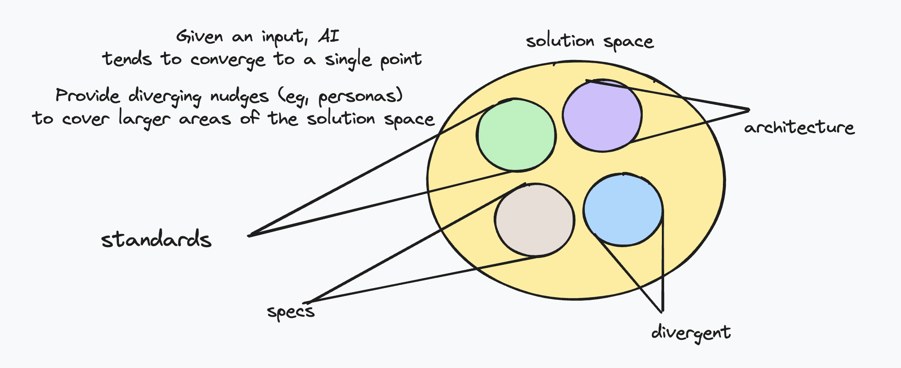

# Engineering skills

Skills for day-to-day code work. All of these depend on per-repo configuration — run `/setup-formsg-ai-skills` once in a repo before using any other skill here.

## Setup

```
/setup-formsg-ai-skills
```

Writes `docs/agents/` files that tell the other skills:
- **Where tickets live** — GitHub Issues or local `.scratch/` markdown
- **Triage label strings** — the five canonical triage roles (`needs-triage`, `needs-info`, `ready-for-agent`, `ready-for-human`, `wontfix`)
- **Domain doc layout** — where `CONTEXT.md` and `docs/adr/` live
- **Review-prep conventions** — commit style and breadcrumb schema consumed by `tdd` and `prepare-for-review`

## Skills

| Skill | Description |
|-------|-------------|
| [`/setup-formsg-ai-skills`](setup-formsg-ai-skills/SKILL.md) | Scaffold per-repo agent config — run this first |
| [`/domain-modeling`](domain-modeling/SKILL.md) | Build and sharpen the project's domain model — terminology, `CONTEXT.md`, and ADRs |
| [`/codebase-design`](codebase-design/SKILL.md) | Shared vocabulary for designing deep modules — interface, depth, seam, adapter |
| [`/grill-for-implementation`](grill-for-implementation/SKILL.md) | Grill a concrete implementation plan into pinned implementation decisions in the spec or tickets |
| [`/to-spec`](to-spec/SKILL.md) | Turn conversation context into a spec and publish it to the ticket tracker — no interview |
| [`/to-tickets`](to-tickets/SKILL.md) | Break a plan or spec into tracer-bullet tickets with blocking edges on the ticket tracker |
| [`/tdd`](tdd/SKILL.md) | Red-green-refactor loop; frontend slices get a visual gate against a Figma design source via Storybook |
| [`/prepare-for-review`](prepare-for-review/SKILL.md) | Assemble a PR body and inline comments from breadcrumbs, ADRs, and the originating spec/tickets — run when implementation is done |
| [`/review`](review/SKILL.md) | Multi-axis PR review across Standards, Spec, Architecture, and Divergent — each axis runs as a parallel sub-agent |
| [`/split-prs`](split-prs/SKILL.md) | Reorganize a large PR into a gh-stack of deployable slices — each safe to ship alone, review-by-commit |
| [`/improve-codebase-architecture`](improve-codebase-architecture/SKILL.md) | Scan for deepening opportunities, present them as an HTML report, then grill through the one you pick |
| [`/wayfinder`](wayfinder/SKILL.md) | Plan work too big for one session as a shared map of decision tickets — resolve them one at a time until the way is clear |

## Recommended workflow

The goal is to spend the bulk of your time thinking and setting guardrails — before a single line of code is written.

### 1. Plan (spend ~80% of your time here)

```
/grill-for-implementation
```

Interview yourself relentlessly against the existing domain model (via `/domain-modeling`). Put load-bearing engineering decisions on the frontier — schema shape, failure modes, ordering, architecture — and pin each settled decision as a **pinned implementation decision** in the spec or tickets so later agents execute them verbatim.

| Grill-me — your prompt only installs the guardrails halfway; install the rest with grill-me |
|:---:|
|  |

### 2. Write the spec

```
/to-spec
```

Synthesises everything from the grilling session into a spec and publishes it to the ticket tracker. No need to review the AI's summary — the grilling session already captured the decisions.

### 3. Split into tickets

```
/to-tickets
```

Breaks the spec into tracer-bullet vertical-slice tickets, each declaring its blocking edges. Each ticket goes to a **fresh agent** with undiluted context — do not carry the planning conversation into implementation.

| Vertical slicing — cut through every layer, not layer by layer |
|:---:|
|  |

### 4. Implement with TDD (one ticket per agent)

```
/tdd
```

Red-green-refactor loop per ticket. For frontend slices, the skill runs a visual gate against a Figma design source via an agent browser — make sure [`agent-browser`](https://github.com/browserbase/agent-browser) (or equivalent) is installed before starting.

The loop: write a failing test → make it pass → refactor → drop a breadcrumb for any non-obvious decision → repeat.

| TDD — keep the agent on the path |
|:---:|
|  |

### 5. Prepare for review

```
/prepare-for-review
```

Collects the breadcrumbs, relevant ADRs, and the originating spec/tickets and assembles them into a PR body and inline comments. The goal is a PR that reviewers can understand, verify, and merge without needing to re-derive rationale from the diff.

| Prepare for review — help reviewers understand, verify, and evaluate decisions |
|:---:|
|  |

### 5b. Or split a large change into stacked PRs

```
/split-prs
```

When the branch is too big for one reviewable PR, reorganize it into a **gh-stack** of **deployable slices** — each safe to merge and ship alone, review-by-commit, with PR bodies prepared from the same review template. Propose the stack and wait for approval before rewriting history. Requires the `gh` stack extension (`gh extension install github/gh-stack`).

### 6. Review

```
/review
```

Runs four independent parallel sub-agents across the diff — Standards, Spec, Architecture, and Divergent design — then filters false positives and surfaces findings side-by-side. Use this before merging to catch issues across all four axes without one axis polluting another's context.

| Review — use diverging nudges to cover a larger solution space |
|:---:|
|  |

---

### At a glance

```
/setup-formsg-ai-skills          # once per repo

/grill-for-implementation        # 80% of effort: think, plan, pin implementation decisions
/to-spec                         # publish spec (no need to review AI summary)
/to-tickets                      # split into tickets → each gets a fresh agent

# per ticket, in a new agent session:
/tdd                             # red-green-refactor (install agent-browser first)

# when implementation is done:
/prepare-for-review              # build PR from breadcrumbs + ADRs
# or, if the branch is too large for one PR:
/split-prs                       # gh-stack of deployable, review-by-commit slices

/review                          # 4-axis review: Standards, Spec, Architecture, Divergent
```
