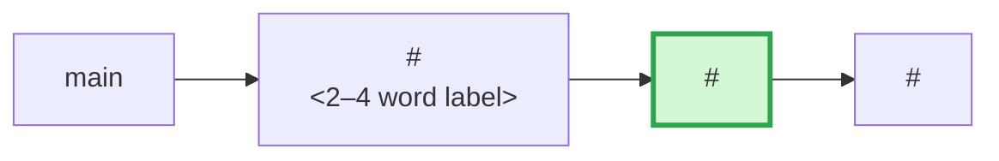

# PR Body Template

Written for a reviewer skimming, not the author archiving. Hard cap: **400 words**, fits on one screen.

## Style rules

- Plain conversational language, short sentences. The project's `CONTEXT.md` (if present) is the glossary for terms.
- **No paragraph over 3 sentences.** If a paragraph wants to grow, it becomes labelled bullets.
- Inline code refs (`function`, `flag-name`) are fine; file paths and line numbers are not — that's what inline comments are for.
- **No "Alternatives considered" section.** A rejected alternative only matters at the line where the choice was made — put it there as an author inline comment (SKILL.md step 5). If it isn't tied to a line, the reviewer doesn't need it.
- Omit any section whose source is empty — no "N/A", no placeholder.

## Template

```md
## Context

<2–3 sentences: the *what* and the *why* — what this PR delivers and why it's wanted, from the user's/product's point of view, not the code's. Works for bug fixes ("X is broken because Y") and plain feature work ("we're adding X so that Y") alike. End with "Closes <issue-ref>" if one exists.>

**Stack** — <n/m. Only if this PR is part of a stack; omit everything in this block for standalone PRs.>

<One sentence: what the previous PRs put in place that this one builds on, and what the next one does with this.>



## Implementation

<One sentence: the shape of the change — the *how* — including any flag/gate it hides behind.>

<Layer map: fenced mermaid block generated by the `pr-layer-map` skill — paste its script output verbatim, never hand-write it. Shows which layers of the stack the diff touches.>

- **<Layer or concern>** — <one sentence: what changed there. Match bullet grouping to the layers lit up in the diagram.>
- **<Layer or concern>** — <one sentence.>
- ...

**Breaking Changes**

<One line. "No — <why existing behaviour is untouched>." or "Yes — <what breaks> + <migration step>".>

## Before & After Screenshots

<Frontend PRs only — see SCREENSHOTS.md. Omit otherwise.>

## Tests

<Manual checks only — anything a reviewer/QA must run by hand. Skip anything CI covers. Checkboxes unchecked: this is a reviewer TODO, not a record of author runs.>

**TC1: <scenario headline>**

- [ ] <step with expected outcome>

**TC2: <scenario headline>**

- [ ] <step>
- [ ] <step>

## Deploy Notes

<Only if the PR adds env vars, scripts, migrations, or dependencies — one bullet each. Omit otherwise.>
```

## Sourcing

- **Context**: linked issue/PRD if one exists, else the conversation that produced the branch.
- **Stack**: detect from the PR title ("n/m"), a base branch that isn't `main`, or the user saying so; confirm sibling PRs via `gh pr list --search`. If detection is ambiguous, ask rather than guess.
  - Mermaid diagram: one node per stack PR (`#number<br/>2–4 word label`), current PR styled `fill:#d4f7d4,stroke:#2da44e,stroke-width:3px`. Unopened future PRs collapse into a single `["..."]` node. Escape `&` as `&amp;` (and `<`/`>` other than the `<br/>` as `&lt;`/`&gt;`) in node labels — a raw ampersand breaks GitHub's Mermaid rendering. Mermaid nodes are not clickable on GitHub; the prose sentence above the diagram carries the auto-linked #refs to the neighbouring PRs instead.
  - The stack diagram doesn't count toward the 400-word budget.
- **Layer map**: invoke the `pr-layer-map` skill (`classify_changes.py --branch --base <fixed-point> --mermaid` before the PR exists, `--pr <n>` after). Paste the emitted block verbatim. If the skill isn't installed, omit the diagram — don't hand-write a substitute. Like the stack diagram, it doesn't count toward the word budget.
- **Implementation bullets**: group the diff by layer (backend / frontend / shared / infra) or by concern when a layer has two unrelated changes. One bullet per group.
- **Tests**: the PRD's Tests block if already TC-shaped; else one TC per distinct user-visible scenario, flag-off default first.

## Length budget

If over 400 words, cut in this order: Implementation bullets merged, TC steps collapsed, Context trimmed. The diff already shows the *what*.
